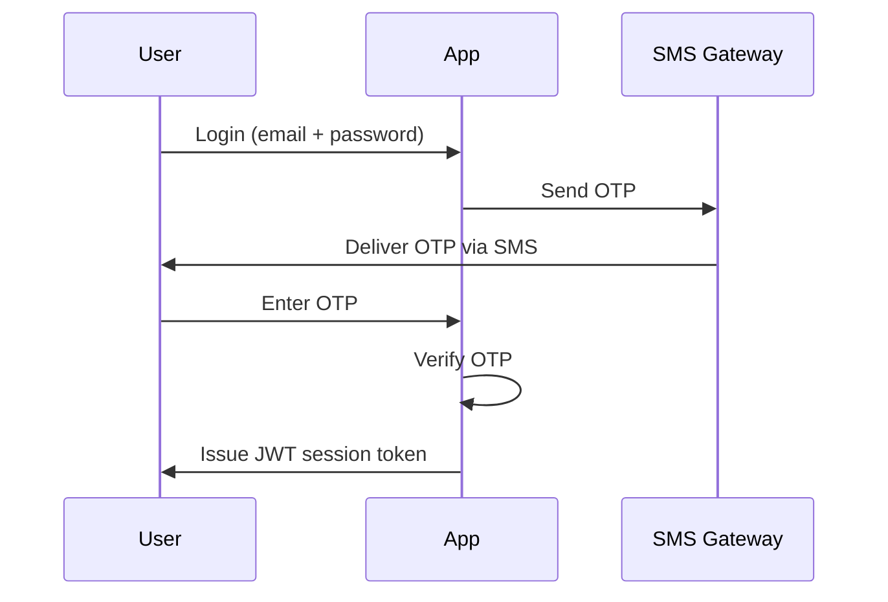

# Multi-Factor Authentication (MFA) Implementation

## Overview

This document describes the implementation of Multi-Factor Authentication (MFA) for the User Management Web Application. MFA adds an additional layer of security by requiring a One-Time Password (OTP) sent via SMS after the primary login.

---

## User Experience

### Signup Flow

1. User registers with email and password.
2. Email verification required.
3. After first login, user must provide a phone number.
4. Phone number is verified with an SMS OTP.

### Login Flow

1. User enters email and password.
2. System validates credentials.
3. An SMS OTP is sent to the registered phone number.
4. User enters OTP to complete login.
5. On success, a session is established with a JWT token.

### Recovery Options

- Users can update phone numbers through profile settings (requires password confirmation).
- Admins can reset MFA for users with an audit trail.

---

## MFA Flow Design



---

## Technical Implementation

### Database Schema Extensions

#### Phone Verification Table

```sql
CREATE TABLE phone_verifications (
    id SERIAL PRIMARY KEY,
    user_id INTEGER NOT NULL REFERENCES users(id) ON DELETE CASCADE,
    phone_number VARCHAR(15) NOT NULL,
    otp_code VARCHAR(6) NOT NULL,
    created_at TIMESTAMP WITH TIME ZONE DEFAULT CURRENT_TIMESTAMP,
    expires_at TIMESTAMP WITH TIME ZONE NOT NULL,
    verified_at TIMESTAMP WITH TIME ZONE NULL,
    is_used BOOLEAN DEFAULT FALSE
);
```

---

### API Endpoints

#### Setup

- `POST /api/v1/auth/phone/setup` – Register phone number & send OTP
- `POST /api/v1/auth/phone/verify` – Verify phone with OTP

#### Login

- `POST /api/v1/auth/login` – Primary login (returns mfa_required flag)
- `POST /api/v1/auth/mfa/verify` – Verify OTP after login

#### Recovery

- `POST /api/v1/auth/phone/update` – Update phone number (requires password)
- `POST /api/v1/auth/mfa/reset` – Admin resets MFA for a user

---

## Security Considerations

| Feature        | Value                        | Notes                          |
| -------------- | ---------------------------- | ------------------------------ |
| OTP Length     | 6 digits                     | Numeric only                   |
| OTP Expiration | 5 minutes                    | Prevents reuse                 |
| Attempts Limit | 5 per 15 minutes             | Lockout on exceeding limit     |
| SMS Rate Limit | 3 messages per hour per user | Mitigates abuse                |
| Storage        | OTPs hashed with bcrypt      | OTPs never stored in plaintext |

---

## Admin Portal

- **Mandatory MFA** for all admin accounts.
- Ability to reset user MFA (with audit trail).
- Monitoring of MFA status across all users.

---

## Dependencies

### Backend

- SMS provider SDK (e.g., Twilio, Nexmo)
- `celery` – Background task handling for SMS
- `redis` – Task queue and rate limiting

### Frontend

- OTP input component
- Phone number management interface
